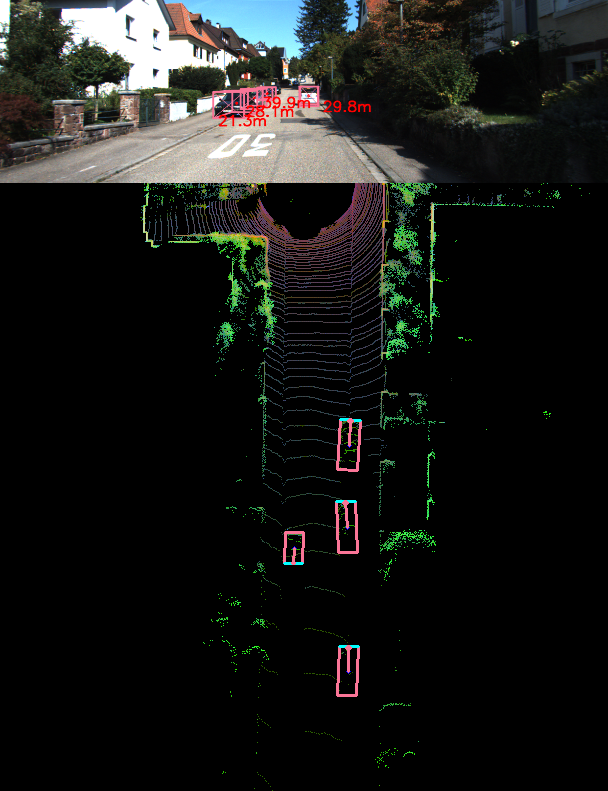

# 3D object distance estimation from the BEV representations
This study introduces a robust perception framework for autonomous driving by fusing LiDAR and monocular camera data. It handles object detection, distance estimation, and multi-object tracking using BEV-based encoding, geometric triangulation, and Extended Kalman Filter, achieving state-of-the-art results on KITTI with high accuracy and efficiency.
This is the extension code with implemented Extended Kalman filter-based tracker for the [Super Fast and Accurate 3D Object Detection based on 3D LiDAR Point Clouds](https://github.com/maudzung/SFA3D)

## EKF implementation

The main idea of the tracking mechanism is in multiple key features that include initialization, prediction, correction track management, track update algorithm, and track creation and deletion. We applied the Extended Kalman Filter method for the track prediction and correction of the frames. 
The tracker backbone was written in _tracker.py_. Refer to the **def draw_prediction** function inside _evaluation_utils.py_ for the EKF initialization and drawing results.

## Results
Check the results of the work

